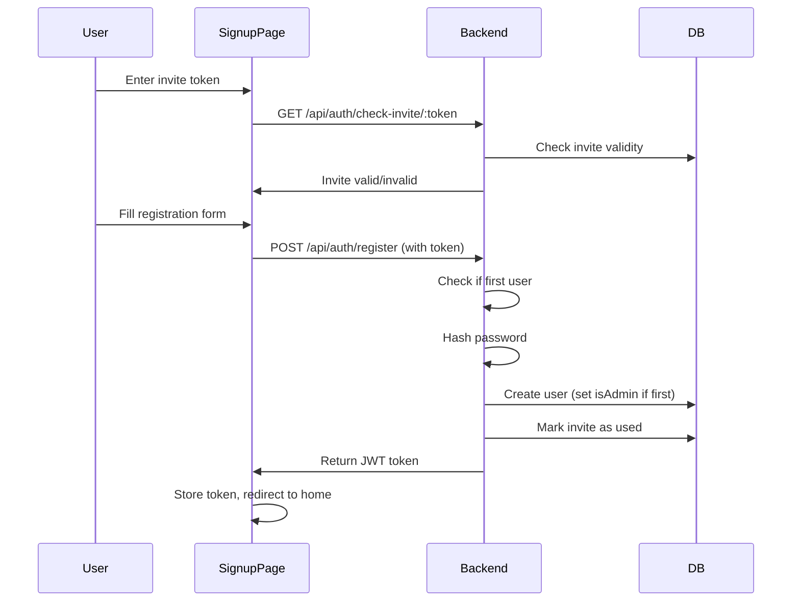
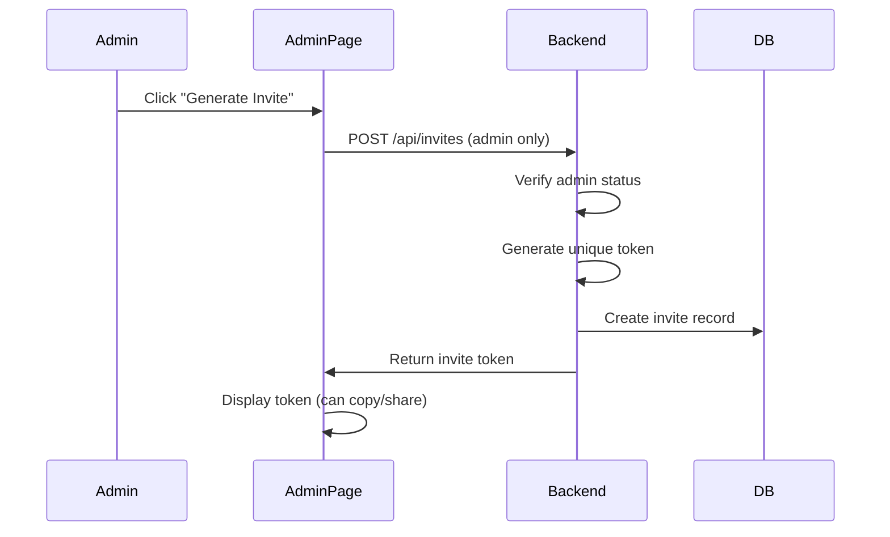

# Multi-User Authentication System with Invite-Based Registration

## Overview
Add authentication system with invite-based registration. Only admin can generate invites. First registered user becomes admin. Non-authenticated users see only a signup page (no recipe access). Users need an invite token to register. Includes login, logout, password reset, and email verification endpoints.

## Database Schema Changes

### User Model
Add to `[backend/prisma/schema.prisma](backend/prisma/schema.prisma)`:
- `User` model with fields:
  - `id` (UUID, primary key)
  - `email` (unique, required)
  - `passwordHash` (required)
  - `name` (optional)
  - `isAdmin` (boolean, default false)
  - `emailVerified` (boolean, default false)
  - `emailVerificationToken` (string, optional)
  - `passwordResetToken` (string, optional)
  - `passwordResetExpires` (DateTime, optional)
  - `createdAt`, `updatedAt`

### Invite Model
Add to `[backend/prisma/schema.prisma](backend/prisma/schema.prisma)`:
- `Invite` model with fields:
  - `id` (UUID, primary key)
  - `token` (string, unique, required) - unique invite token
  - `email` (string, optional) - optional email restriction
  - `createdBy` (User relation, userId)
  - `usedBy` (User relation, optional, userId) - tracks who used the invite
  - `usedAt` (DateTime, optional) - when invite was used
  - `expiresAt` (DateTime, optional) - optional expiration
  - `createdAt`, `updatedAt`
  - Index on `token` for fast lookups

### Recipe Model
Update `Recipe` model in `[backend/prisma/schema.prisma](backend/prisma/schema.prisma)`:
- Add `userId` (optional, nullable) for tracking creator (recipes remain visible to all users)

## Backend Implementation

### Dependencies
Add to `[backend/package.json](backend/package.json)`:
- `jsonwebtoken` and `@types/jsonwebtoken` for JWT
- `bcryptjs` and `@types/bcryptjs` for password hashing
- `crypto` (built-in) for token generation

### Auth Service
Create `[backend/src/services/authService.ts](backend/src/services/authService.ts)`:
- `hashPassword(password: string): Promise<string>` - hash passwords with bcrypt
- `verifyPassword(password: string, hash: string): Promise<boolean>` - verify passwords
- `generateToken(userId: string): string` - generate JWT tokens
- `verifyToken(token: string): { userId: string } | null` - verify JWT tokens
- `generateVerificationToken(): string` - generate email verification tokens
- `generateResetToken(): string` - generate password reset tokens
- `generateInviteToken(): string` - generate unique invite tokens

### Auth Middleware
Create `[backend/src/middleware/auth.ts](backend/src/middleware/auth.ts)`:
- `authenticate` middleware to verify JWT tokens from Authorization header
- `requireAdmin` middleware to ensure user is admin
- `optionalAuth` middleware for routes that work with or without auth

### Auth Routes
Create `[backend/src/routes/auth.ts](backend/src/routes/auth.ts)`:
- `POST /api/auth/register` - Register new user (requires valid invite token, first user becomes admin)
- `POST /api/auth/login` - Login (verify credentials, return token)
- `POST /api/auth/logout` - Logout (client-side token removal)
- `GET /api/auth/me` - Get current user info (protected)
- `POST /api/auth/verify-email` - Verify email with token
- `POST /api/auth/forgot-password` - Request password reset (generate token, store in DB)
- `POST /api/auth/reset-password` - Reset password with token
- `GET /api/auth/check-invite/:token` - Check if invite token is valid (public, for signup page)

### Invite Routes (Admin Only)
Create `[backend/src/routes/invites.ts](backend/src/routes/invites.ts)`:
- `POST /api/invites` - Generate new invite (admin only, optional email restriction)
- `GET /api/invites` - List all invites (admin only, show usage status)
- `DELETE /api/invites/:id` - Revoke invite (admin only)
- `GET /api/invites/stats` - Get invite statistics (admin only)

### Update Recipe Routes
Update `[backend/src/routes/recipes.ts](backend/src/routes/recipes.ts)`:
- Add `authenticate` middleware to all routes (require authentication)
- When creating recipes, store `userId` of creator
- Keep all recipes visible to all authenticated users (no filtering by userId)

### Update Server
Update `[backend/src/server.ts](backend/src/server.ts)`:
- Add auth routes: `app.use('/api/auth', authRoutes)`
- Add invite routes: `app.use('/api/invites', inviteRoutes)`

### Environment Variables
Add to `[backend/.env.example](backend/.env.example)`:
- `JWT_SECRET` - Secret key for signing JWT tokens
- `JWT_EXPIRES_IN` - Token expiration (e.g., "7d")

## Frontend Implementation

### Dependencies
Add to `[frontend/package.json](frontend/package.json)`:
- No new dependencies needed (use existing shadcn components)

### Shadcn Components
Add shadcn components if not already present:
- `form.tsx` - for form handling
- `label.tsx` - for form labels
- `alert.tsx` - for error messages
- `table.tsx` - for admin invite list
- `dropdown-menu.tsx` - for admin menu

### Auth Context
Create `[frontend/src/contexts/AuthContext.tsx](frontend/src/contexts/AuthContext.tsx)`:
- Auth context with `user`, `token`, `login`, `logout`, `register` functions
- Store JWT token in localStorage
- Provide auth state to entire app
- Check if user is admin

### Auth API
Update `[frontend/src/lib/api.ts](frontend/src/lib/api.ts)`:
- Add auth functions:
  - `register(email, password, name?, inviteToken)`
  - `login(email, password)`
  - `logout()`
  - `getCurrentUser()`
  - `verifyEmail(token)`
  - `forgotPassword(email)`
  - `resetPassword(token, newPassword)`
  - `checkInvite(token)` - check if invite token is valid
- Update existing API functions to include JWT token in Authorization header

### Invite API
Add to `[frontend/src/lib/api.ts](frontend/src/lib/api.ts)`:
- `createInvite(email?)` - generate new invite (admin only)
- `getInvites()` - list all invites (admin only)
- `deleteInvite(inviteId)` - revoke invite (admin only)
- `getInviteStats()` - get invite statistics (admin only)

### Auth Pages
Create `[frontend/src/pages/SignupPage.tsx](frontend/src/pages/SignupPage.tsx)`:
- Pre-registration page (shown to non-authenticated users)
- Two options:
  1. "I have an invite code" - form with invite token input
  2. "Request an invite" - message explaining only admin can send invites
- If invite token provided and valid, show registration form
- Use shadcn form components

Create `[frontend/src/pages/LoginPage.tsx](frontend/src/pages/LoginPage.tsx)`:
- Login form with email and password fields
- Link to signup page
- Link to forgot password page
- Use shadcn form components

Create `[frontend/src/pages/ForgotPasswordPage.tsx](frontend/src/pages/ForgotPasswordPage.tsx)`:
- Form to request password reset (email input)
- Show success message

Create `[frontend/src/pages/ResetPasswordPage.tsx](frontend/src/pages/ResetPasswordPage.tsx)`:
- Form to reset password with token (from URL query param)
- New password and confirm password fields

Create `[frontend/src/pages/VerifyEmailPage.tsx](frontend/src/pages/VerifyEmailPage.tsx)`:
- Verify email with token from URL query param
- Show success/error message

### Admin Pages
Create `[frontend/src/pages/AdminInvitesPage.tsx](frontend/src/pages/AdminInvitesPage.tsx)`:
- Admin-only page for managing invites
- Table showing all invites (token, email restriction, used status, created date)
- Button to generate new invite
- Form to generate invite with optional email restriction
- Button to revoke/delete invites
- Statistics (total invites, used, unused, expired)

### Update App
Update `[frontend/src/App.tsx](frontend/src/App.tsx)`:
- Wrap app with `AuthProvider`
- Add React Router routes:
  - `/signup` - SignupPage (public, invite-based registration)
  - `/login` - LoginPage (public)
  - `/forgot-password` - ForgotPasswordPage (public)
  - `/reset-password` - ResetPasswordPage (public, with token query param)
  - `/verify-email` - VerifyEmailPage (public, with token query param)
  - `/admin/invites` - AdminInvitesPage (protected, admin only)
  - `/` - HomePage (protected, redirect to signup if not authenticated)

### Update HomePage
Update `[frontend/src/pages/HomePage.tsx](frontend/src/pages/HomePage.tsx)`:
- Add logout button in header/navbar
- Show current user email/name
- Add "Admin" link/button if user is admin (link to `/admin/invites`)
- Redirect to `/signup` if not authenticated (instead of `/login`)

### Protected Route Component
Create `[frontend/src/components/ProtectedRoute.tsx](frontend/src/components/ProtectedRoute.tsx)`:
- Component that checks auth state
- Redirects to `/signup` if not authenticated
- Renders children if authenticated

### Admin Route Component
Create `[frontend/src/components/AdminRoute.tsx](frontend/src/components/AdminRoute.tsx)`:
- Component that checks auth state and admin status
- Redirects to `/signup` if not authenticated
- Redirects to `/` if authenticated but not admin
- Renders children if admin

## Implementation Flow

### Registration Flow

### Invite Generation Flow

## Notes
- First registered user automatically becomes admin
- Invites can optionally be restricted to specific email addresses
- Invites can have optional expiration dates
- Email sending is skipped for now (endpoints store tokens in DB, can add email service later)
- Recipes remain shared - all authenticated users see all recipes
- JWT tokens stored in localStorage
- Password reset tokens expire after 1 hour
- Email verification tokens don't expire
- Non-authenticated users only see signup page (no recipe access)

## Testing Checklist
- [ ] First user registration automatically becomes admin
- [ ] Admin can generate invites
- [ ] Admin can view list of invites
- [ ] Admin can revoke invites
- [ ] User cannot register without valid invite token
- [ ] User can register with valid invite token
- [ ] Invite is marked as used after registration
- [ ] Non-authenticated users see only signup page
- [ ] Authenticated users can access recipes
- [ ] Admin can access admin pages
- [ ] Non-admin users cannot access admin pages
- [ ] Login/logout works correctly
- [ ] Password reset flow works
- [ ] Email verification flow works