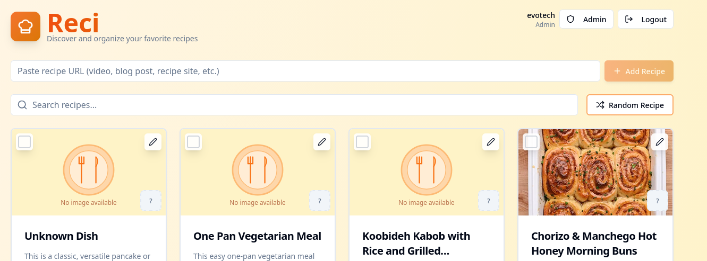

# Reci

[](https://opensource.org/licenses/MIT)
[](https://github.com/evolite/reci/releases)
[](https://github.com/evolite/reci/issues)

A personal recipe video library. Paste a YouTube/TikTok/Instagram URL — AI extracts the recipe, ingredients, and instructions. Everything runs in a single container with SQLite.



## Quick Start

```bash
podman run -d \
  -p 4000:4000 \
  -v reci-data:/data \
  -e JWT_SECRET="your-secret" \
  -e OPENAI_API_KEY="sk-..." \
  -e CORS_ORIGIN="https://reci.example.com" \
  ghcr.io/evolite/reci:latest
```

Open `http://localhost:4000`. The AI provider and API key can also be configured in the admin panel after first run.

## Environment Variables

| Variable | Required | Default | Description |
|---|---|---|---|
| `JWT_SECRET` | Yes | — | Secret for signing JWT tokens |
| `OPENAI_API_KEY` | No | — | API key (or set it in admin settings) |
| `CORS_ORIGIN` | Yes (prod) | `*` | Allowed origin (e.g. `https://reci.example.com`) |
| `PORT` | No | `4000` | Port the server listens on |

The database is created automatically at `/data/reci.db`. Mount a volume at `/data` to persist it.

## AI Providers

Configure in **Settings → AI Provider Configuration**. Supports OpenAI, Anthropic Claude, Google Gemini, and any OpenAI-compatible server (Ollama, vLLM, etc.).

## Build from Source

```bash
git clone https://github.com/evolite/reci.git
cd reci
podman build -t reci:latest .
podman run -d -p 4000:4000 -v reci-data:/data -e JWT_SECRET="your-secret" reci:latest
```

## License

MIT
